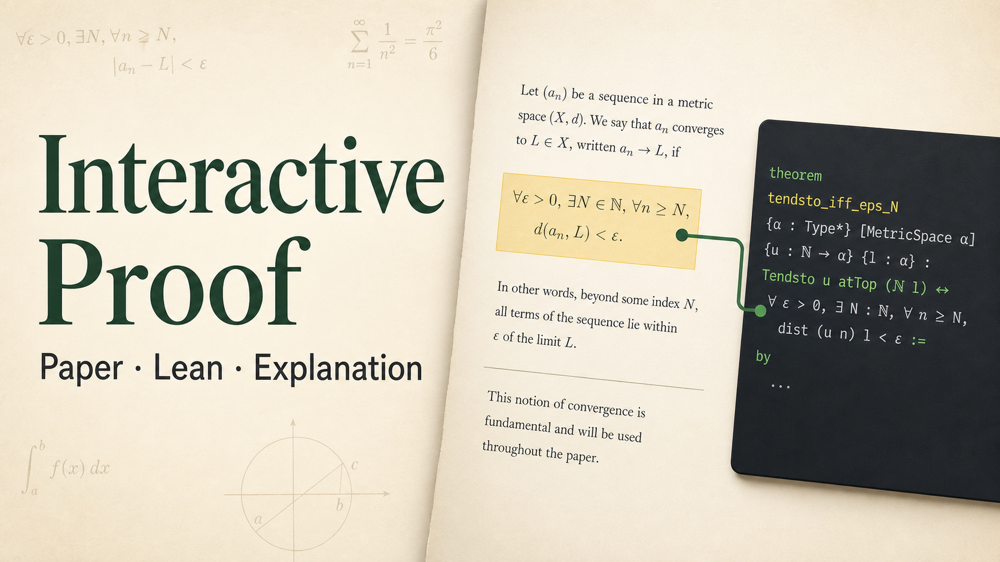

# Interactive Proof

Interactive Proof is an educational upload-first companion for mathematical papers and their Lean formalizations. Upload a PDF, select a sentence or equation, and request a focused explanation. Add Lean only when it helps connect the idea to formal code.

This repository contains a tested release candidate. The public demo starts with a temporary upload workspace for papers and optional Lean source. A cleared proof fixture remains in the repository for deterministic validation, not as the public starting flow.

<p align="center">
  
</p>

Interactive Proof keeps the source in view while it explains: a reader can move from a paper passage to its mapped Lean declaration, open the proof details, and ask a focused question without losing their place.

## See the product direction

<p align="center">
  
</p>

<p align="center">
</p>

## Demo assets

The reviewed media package lives in [`docs/submission/media/`](docs/submission/media/README.md):

- [Thumbnail](docs/submission/media/interactive-proof-thumbnail.png)
- [Documentation capture](docs/submission/media/setup-docs-desktop.png)
- [Key-free rehearsal video](docs/submission/media/demo-rehearsal-key-free.mp4)

The rehearsal is intentionally recorded without a live model request. Record the final narrated stream only after deployment with the server-side API key.

## Internal validation fixture

| Package | Paper | Lean source | Verification | License status |
|---|---|---|---|---|
| `odd-sum-square` | Authored one-page introduction to induction | Complete local Lean file | Passed on the recorded toolchain; open the in-reader evidence panel for details | Paper is CC BY 4.0 |

The repository fixture supports deterministic tests and validation; it is not linked from the public site. The public experience is the upload workspace.

## Quick start

Requirements:

- Node.js 24
- npm
- Chromium only if running browser tests
- Lean only if regenerating local proof verification

Install and start the app:

```bash
npm ci
cp .env.example .env.local
npm run dev
```

Open [http://localhost:3000/upload](http://localhost:3000/upload) to start with a paper.

The in-app setup and reader guide is available at [http://localhost:3000/docs](http://localhost:3000/docs). Repository setup and deployment details are also collected in [docs/SETUP.md](docs/SETUP.md).

To work with your own material, open [http://localhost:3000/upload](http://localhost:3000/upload). A PDF is required and Lean source is optional. Files are parsed in the browser and remain temporary; only a bounded selection and nearby text are sent when you explicitly request an AI explanation. Uploaded Lean is always labeled unverified.

### Environment

```dotenv
OPENAI_API_KEY=
OPENAI_MODEL=gpt-5.6
EXPLAIN_RATE_LIMIT_PER_HOUR=30
PUBLIC_PROOF_IDS=odd-sum-square
```

`OPENAI_API_KEY` remains server-side. With a valid key, upload selections call the streamed `/api/explain-upload` route. Without a key, the upload workspace and selection UI remain available; an explanation request returns an explicit configuration error rather than a fabricated answer. Never commit `.env.local`.

For Sites, add `OPENAI_API_KEY` as a production secret and add the remaining values as production environment variables. Do not use a `NEXT_PUBLIC_` prefix. Environment changes take effect only after deploying a newly saved site version.

`PUBLIC_PROOF_IDS` is optional for local development. Production releases must set a non-empty explicit list; unknown and duplicate IDs fail registry generation. Only listed packages are registered or copied into `public/proof-assets`.

## Architecture

```text
app/
  api/explain/                 validated, rate-limited Responses API stream
  api/explain-upload/          bounded stream for reader-provided context
  proofs/[proofId]/            internal fixture reader and PDF route
  upload/                      temporary PDF and optional Lean workspace
components/
  paper-reader/                PDF.js canvas and selectable text layer
  proof-reader/                shared paper/Lean workspace
  selection-menu/              contextual actions
  explanation-panel/           streamed answer and evidence states
lib/
  proof-packages/              schemas, safe paths, registry, package loader
  explanation/                 canonical context construction and model transport
  uploads/                     client parsers and temporary context boundary
  verification/                verification schema and status policy
proofs/<id>/                   repository-owned internal proof fixtures
scripts/                       extraction, registry, validation, and Lean verification
```

The browser sends bounded parsed upload context and a selection location to the upload route. The server enforces size and source limits and supplies only application-defined source metadata to the model. The separate curated-package route is for internal fixtures and verification; model prose never creates source chips or verification badges.

## Commands

### Application and tests

```bash
npm run dev
npm run proof:validate
npm run eval:validate
npm test
npm run typecheck
npm run lint
npm run build
npm run release:check
```

Browser smoke test:

```bash
npx playwright install chromium
PLAYWRIGHT_SERVER=development npm run test:e2e:smoke
PLAYWRIGHT_SERVER=production npx playwright test tests/e2e/reader-smoke.spec.ts tests/e2e/methodology.spec.ts --project=chromium --grep 'opens the upload workspace|publishes the fixed methodology|returns an upload-first 404'
```

Run `npm run test:e2e` for every configured desktop and mobile project.

The full focused smoke suite exercises the curated fixture reader in development. Production deliberately redirects that reader to `/upload`, so its focused checks exercise the upload entry, methodology, and unknown-proof 404 instead.

### Proof-package checks

Install [elan](https://github.com/leanprover/elan) and the pinned toolchain before running `npm test` (which includes real compiler fixtures) or `proof:verify`:

```bash
elan toolchain install "$(cat proofs/odd-sum-square/lean-toolchain)"
```

CI installs this toolchain explicitly; compiler regression tests fail rather than silently skip when Lean is unavailable.

```bash
npm run proof:registry
npm run proof:validate
npm run proof:verify
```

- `proof:registry` validates packages and regenerates the allowlisted registry.
- `proof:validate` checks schemas, assets, source references, line ranges, and PDF hashes.
- `proof:verify` runs supported full local Lean packages and atomically rewrites their `verification.json` records.

A local package receives `passed` only when the manifest revision and toolchain match, Lean exits successfully, no real `sorry` or `admit` token remains, every declared `#print axioms` audit appears in Lean's output, and no reported declaration depends on `sorryAx`. This includes admissions inherited through imported lemmas even when the mapped source has zero admission tokens. Nested comments, string and character literals, and quoted identifiers are excluded from the admission scan. Failures are written as `failed` with the actual Lean exit code and output digest; the verifier command exits nonzero even when Lean itself exits 0.

Lean's foundational axioms `propext` (propositional extensionality), `Classical.choice` (choice from a nonempty type), and `Quot.sound` (related values have equal quotient constructors) are allowed and retained in the axiom report. The gate rejects `sorryAx`, rather than rejecting all axioms. Other axioms are also recorded for author review; this gate does not certify that a declaration uses only those three foundational axioms. Use explicit fully qualified audit names outside their namespace; Unicode, subscript, prime-suffixed, and `«quoted identifiers»` are supported, including quoted components within qualified names.

In standard `s!`/`m!` interpolated strings, the scanner ignores literal prose and scans the real Lean terms inside `{...}` for admissions, including nested comments and string literals within those terms.

To verify only one package:

```bash
npm run proof:verify -- odd-sum-square
```

## Author a proof package

Start with the command-driven workflow:

```bash
npm run proof:new -- my-proof "My Proof Title"
# supply proofs/my-proof/paper.pdf and Lean source
npm run proof:extract -- my-proof
npm run proof:check -- my-proof
npm run proof:preview -- my-proof
```

The scaffold is atomic, refuses existing destinations and unsafe IDs, begins with `review-required` rights and `not-run` verification, and intentionally fails release readiness until a contributor supplies and reviews the real assets. Generated registries remain untouched until normal package validation succeeds.

Create `proofs/<proof-id>/` with:

```text
proof.json
paper.pdf
paper.pages.json
lean/
verification.json
```

Then:

1. Record the paper's authors and license status. Use `review-required` when rights are not established.
2. Extract or curate page blocks and store the PDF SHA-256 in `paper.pages.json`.
3. Add Lean files and exact declaration line ranges.
4. Create paper-to-Lean mappings, prerequisites, dependencies, and glossary entries in `proof.json`.
5. For a full local Lean package, pin `lean-toolchain`, add explicit `#print axioms <declaration>` audits, and set the manifest revision to `sha256:<combined Lean source digest>`.
6. Run `npm run proof:verify -- <proof-id>` and inspect the generated evidence.
7. Run `npm run proof:registry`, `npm run proof:validate`, and the full test/build gate.

Do not label display excerpts as full source. Do not copy a paper, repository, diagram, or substantial excerpt into a public package until its license and attribution are documented.

## Proof details

Every proof reader has a **Proof details** disclosure containing:

- build result and exact command exit code;
- source revision and Lean toolchain;
- command and checked timestamp;
- `sorry`/`admit` count;
- declaration-level axiom results;
- digest of captured Lean output.

A successful Lean build verifies the recorded formal declaration. It does not prove that the declaration is a perfect translation of the paper; correspondence remains a separately curated claim.

## Licensing and attribution

Repository code is available under the [MIT License](LICENSE). That license does not automatically cover bundled papers, Lean repositories, generated artifacts based on outside sources, or third-party dependencies.

See [THIRD_PARTY_NOTICES.md](THIRD_PARTY_NOTICES.md) for the attribution and rights-status matrix. Bundled papers and Lean sources retain their own license and attribution terms; review those terms before adding new package assets. Uploaded material stays in the user's temporary browser workspace and is not added to the repository.

## Codex and GPT-5.6 workflow

Codex was used as a repository collaborator for planning, implementation, test generation, browser/PDF inspection, proof-package validation, and release checks. The working pattern follows OpenAI's guidance: provide the goal, relevant files, constraints, and a concrete definition of done; then review diffs and require observable tests before accepting changes. See the official [Codex documentation](https://developers.openai.com/codex/) and [prompting guidance](https://developers.openai.com/codex/prompting/).

The application uses the OpenAI Responses API through the official JavaScript SDK, with `gpt-5.6` as the hackathon configuration default. The server supplies bounded, deterministic paper/Lean context, streams response text, disables model tools for the MVP, and keeps source/verification UI under application control. Human review is still responsible for mathematical interpretation, paper-to-Lean correspondence, licensing, and release claims.

Before submission, preserve the Codex `/feedback` session ID that covers the core implementation and add it to the paste-ready [Devpost submission copy](docs/submission/DEVPOST.md).

## Deployment

The public demo is available at [interactive-proof.jjjhenriksen.chatgpt.site](https://interactive-proof.jjjhenriksen.chatgpt.site/). It is accessible without an account and keeps the OpenAI key server-side. The public journey starts at `/upload`; uploaded files remain temporary to the browser session. The bundled proof package is retained for deterministic tests and internal verification, not as a public reading-room catalogue.

A deployment must provide:

- Node server routes and streamed responses;
- `OPENAI_API_KEY` as a server-only secret;
- anonymous access for judges;
- PDF.js worker delivery and local PDFs;
- an appropriate request-rate limit;
- a public URL and submission details recorded in `docs/submission/DEVPOST.md`.

After deployment, test the upload workspace in a private browser session: paper upload, paper selection, optional Lean upload, a follow-up, mobile layout, keyboard navigation, temporary clearing, and the no-key/error path.

## Troubleshooting

**The reader works but explanations fail.** Check `.env.local`, restart the dev server after changing it, and confirm `OPENAI_API_KEY` is present. A missing key intentionally returns HTTP 503.

**A PDF renders but selection does not align.** Regenerate or curate `paper.pages.json`, confirm its PDF SHA-256, and run `npm run proof:validate`. PDF text extraction and PDF.js may normalize mathematical glyphs differently.

**`proof:verify` skips a package.** Only packages with `lean.displayMode: "full"` and a local `lean-toolchain` are supported. Uploaded Lean remains temporary and unverified.

**`proof:verify` writes `failed` although Lean exited 0.** Check the manifest source digest and toolchain, remove `sorry`/`admit`, and ensure each intended audit has a `#print axioms` directive whose output can be recorded.

**Playwright cannot launch Chromium.** Run `npx playwright install chromium`, then retry the smoke command.

## Project documents

- [Setup and operator guide](docs/SETUP.md)
- [Product requirements](docs/PRD.md)
- [Implementation plan](PLAN.md)
- [Devpost submission copy](docs/submission/DEVPOST.md)
- [Demo script](docs/submission/DEMO.md)
- [Feature roadmap](docs/features/README.md)
- [Evaluation methodology](docs/EVALUATION.md)

The public `/methodology` route reads the checked-in evaluation status. Live evaluation is optional, requires an explicit confirmation flag, and is never part of key-free CI.

The application source of truth is the upload workspace and generic reader under `app/` and `components/`. The package schema under `lib/proof-packages/` supports internal fixtures and future curated authoring; it is not the public entry flow.
