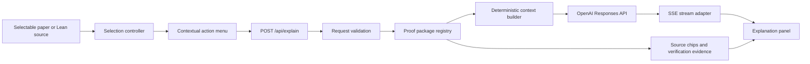

# Technical specification: Interactive Proof MVP

**Status:** Working MVP implemented; deployment verification and submission evidence remain pending

**Implements:** `docs/PRD.md`

**Delivery schedule:** `PLAN.md`

**Target runtime:** Node.js web deployment

**Model:** `gpt-5.6` through the OpenAI Responses API

## 1. System overview

Interactive Proof is a server-backed web reader. Proof packages are repository-owned datasets containing a paper, selectable paper text, Lean source, curated cross-source mappings, glossary entries, and verification evidence. The browser renders and selects sources. The server validates selection metadata, constructs a bounded context bundle, and streams a grounded explanation.



The model is not allowed to choose arbitrary repository files or browse independently in the MVP. Context selection is deterministic and server-controlled.

## 2. Technology choices

### Required

- Next.js App Router with TypeScript strict mode.
- React server components for package loading and client components only where interaction requires them.
- `pdfjs-dist` or a maintained React wrapper using PDF.js for canvas rendering and selectable text layers.
- Official OpenAI JavaScript SDK and the Responses API.
- Zod for runtime validation and inferred TypeScript types.
- Vitest for unit and integration tests.
- Playwright for browser-level interaction tests.
- ESLint and the framework formatter/lint defaults.

### Deferred

- Database, authentication, analytics, vector database, Agents SDK, and durable conversation storage.
- Client global-state library unless component-local and route-level state proves insufficient.
- UI component framework unless it reduces implementation risk without replacing the existing reading-room language.

Exact dependency versions are selected during scaffolding and committed in the lockfile. The Node version is declared in the repository and deployment configuration.

## 3. Route structure

```text
app/
├── layout.tsx
├── page.tsx                         # proof-package index
├── proofs/[proofId]/
│   ├── page.tsx                     # validates and loads package
│   ├── loading.tsx
│   └── not-found.tsx
└── api/explain/
    └── route.ts                     # Node runtime, POST only
```

`/proofs/[proofId]` is the canonical proof-reader URL. Deep links use query parameters or hashes:

```text
/proofs/cycle-double-cover?source=paper&page=2
/proofs/cycle-double-cover?source=lean&declaration=compatibility_solvable
```

Unknown proof IDs return the designed not-found state and never expose filesystem paths.

## 4. Source layout

```text
components/
├── proof-reader/
│   ├── proof-reader.tsx
│   ├── proof-navigation.tsx
│   └── source-switcher.tsx
├── paper-reader/
│   ├── paper-reader.tsx
│   ├── paper-page.tsx
│   └── paper-selection.ts
├── lean-reader/
│   ├── lean-reader.tsx
│   ├── lean-code-view.tsx
│   └── lean-selection.ts
├── selection-menu/
│   ├── selection-menu.tsx
│   └── use-supported-selection.ts
└── explanation-panel/
    ├── explanation-panel.tsx
    ├── explanation-state.ts
    ├── evidence-chip.tsx
    └── follow-up-form.tsx

lib/
├── proof-packages/
│   ├── schema.ts
│   ├── registry.server.ts
│   ├── load-package.server.ts
│   └── locations.ts
├── explanation/
│   ├── request-schema.ts
│   ├── build-context.server.ts
│   ├── build-instructions.server.ts
│   ├── stream-response.server.ts
│   └── types.ts
├── verification/
│   ├── schema.ts
│   └── audit.ts
└── security/
    ├── rate-limit.server.ts
    └── request-limits.ts
```

Files may be consolidated when they are trivial. The important boundary is that proof data, context construction, model transport, and visual interaction do not return to a single monolithic HTML file.

## 5. Proof-package format

### Directory

```text
proofs/<proof-id>/
├── proof.json
├── paper.pdf
├── paper.pages.json
├── guide.json
├── lean/
│   ├── Main.lean
│   └── CubicLabeling.lean
└── verification.json
```

The existing `proofs/cycle-double-cover/index.html` remains unchanged as a legacy reference until the new generic route reaches visual and functional parity. It may then move under `legacy/` in a separate reviewed change.

### Package schema

```ts
type ProofPackage = {
  schemaVersion: 1
  id: string
  title: string
  shortTitle: string
  summary: string
  audience: string
  paper: {
    title: string
    authors: string[]
    pdf: string
    pages: string
    license: {
      status: "cleared" | "review-required" | "link-only"
      name?: string
      url?: string
    }
  }
  lean: {
    repository: string
    revision: string
    toolchain: string
    sourceDirectory: string
    displayMode: "full" | "excerpts"
  }
  glossary: Array<{
    id: string
    term: string
    explanation: string
    sourceIds: string[]
  }>
  mappings: ProofMapping[]
}

type ProofMapping = {
  id: string
  label: string
  paper: {
    sourceId: string
    pages: number[]
    heading?: string
    quote?: string
  }
  lean: Array<{
    sourceId: string
    file: string
    declaration: string
    startLine: number
    endLine: number
  }>
  prerequisites: string[]
  dependencies: string[]
  usedBy: string[]
  correspondence: "direct" | "partial" | "supporting"
  correspondenceNote: string
}
```

All relative asset paths are resolved under the package directory and rejected if they escape it.

### Extracted paper pages

`paper.pages.json` is generated from the PDF and committed for deterministic context retrieval:

```ts
type PaperPages = {
  schemaVersion: 1
  pdfSha256: string
  pages: Array<{
    number: number
    text: string
    blocks: Array<{
      id: string
      text: string
    }>
  }>
}
```

The PDF.js browser text layer provides selection coordinates. The committed text provides authoritative server context. The PDF hash prevents silently pairing extracted text with a different document.

### Verification record

```ts
type VerificationRecord = {
  schemaVersion: 1
  repository: string
  revision: string
  toolchain: string
  command: string
  checkedAt: string
  build: "passed" | "failed" | "not-run"
  exitCode: number | null
  sorryCount: number | null
  axioms: Array<{ declaration: string; axioms: string[] }>
  outputDigest: string | null
}
```

Only the verification script writes a `passed` record. The UI treats `not-run`, a revision mismatch, or a PDF/source mismatch as unverified.

## 6. Package registry

The application uses a generated registry rather than accepting user-supplied paths:

```ts
type ProofRegistryEntry = {
  id: string
  manifestPath: string
}
```

`scripts/build-proof-registry.ts` scans `proofs/*/proof.json`, validates every package, rejects duplicate IDs, and emits a typed registry used by the application build.

Build fails when:

- a package does not validate;
- an asset is missing;
- a mapping references an unknown paper page or Lean file;
- line ranges are invalid;
- a source ID is duplicated;
- relative paths escape the package;
- extracted text does not match the PDF digest.

## 7. Selection model

```ts
type SupportedSelection = {
  proofId: string
  source: "paper" | "lean" | "guide"
  selectedText: string
  location:
    | { source: "paper"; page: number; blockIds: string[] }
    | {
        source: "lean"
        file: string
        declaration: string
        startLine: number
        endLine: number
      }
    | { source: "guide"; section: string }
  clientRect: {
    top: number
    left: number
    right: number
    bottom: number
  }
}
```

### Selection rules

- Trim leading and trailing whitespace.
- Require at least 2 visible characters.
- Limit selected text to 1,200 characters.
- Paper selection must be contained within one page for the MVP.
- Lean selection must be inside a known displayed declaration.
- Clear the menu on source switch, scroll that invalidates the selection, Escape, or an outside pointer action.
- Preserve a serializable selection snapshot when the side panel opens even if the browser selection later collapses.

The client selection is a location hint, not authoritative context. The server validates it against the package and reloads the surrounding source.

## 8. Explanation API

### Endpoint

`POST /api/explain`

### Request

```ts
const ExplainRequestSchema = z.object({
  proofId: z.string().min(1).max(80),
  source: z.enum(["paper", "lean", "guide"]),
  location: SourceLocationSchema,
  selectedText: z.string().min(2).max(1200),
  mode: z.enum(["details", "simpler", "lean", "usage", "question"]),
  question: z.string().trim().max(800).optional(),
  history: z
    .array(
      z.object({
        role: z.enum(["user", "assistant"]),
        text: z.string().max(4000)
      })
    )
    .max(6)
})
```

`question` is required when `mode` is `question`.

### Stream protocol

The route returns `text/event-stream` with application-owned events:

```text
event: context
data: {"selection": {...}, "sources": [...], "verification": {...}}

event: delta
data: {"text": "This sentence..."}

event: completed
data: {"responseId": "...", "usage": {...}}

event: error
data: {"code": "MODEL_ERROR", "message": "The explanation could not be generated."}
```

The server consumes typed Responses API stream events and exposes only the minimal application protocol. Raw provider events and hidden instructions never reach the client.

### Status codes

- `200` — SSE stream established.
- `400` — invalid request or unsupported selection.
- `404` — proof package or source location not found.
- `413` — request exceeds size limits.
- `429` — demo quota exceeded.
- `500` — unexpected server failure before streaming begins.
- `503` — model service unavailable.

Once streaming begins, failures use the `error` event.

## 9. Context construction

```ts
type ContextBundle = {
  proof: {
    id: string
    title: string
    audience: string
  }
  selection: {
    text: string
    sourceId: string
    sourceType: "paper" | "lean" | "guide"
    locationLabel: string
  }
  surroundingSource: SourceExcerpt
  mappedSources: SourceExcerpt[]
  glossary: Array<{ term: string; explanation: string; sourceIds: string[] }>
  prerequisites: string[]
  dependencies: Array<{ id: string; label: string }>
  usedBy: Array<{ id: string; label: string }>
  verification: VerificationSummary
  allowedSourceIds: string[]
}
```

Construction order:

1. Validate the package and requested location.
2. Find the canonical paper block or Lean declaration containing the selection.
3. Compare normalized selected text with the canonical source. Reject a material mismatch.
4. Load the nearest mapping, if any.
5. Add mapped counterparts and explicit correspondence notes.
6. Add referenced glossary and prerequisite entries.
7. Add only direct dependencies and downstream uses.
8. Add verification facts for the current pinned revision.
9. Apply character/token budgets before prompting.

Initial budgets:

- selection: 1,200 characters;
- surrounding source: 8,000 characters;
- mapped sources combined: 16,000 characters;
- glossary and prerequisite material: 5,000 characters;
- recent conversation: six turns and 12,000 characters combined.

These are safety and latency bounds, not model context-window limits.

## 10. Model call

### Configuration

```text
OPENAI_API_KEY=...
OPENAI_MODEL=gpt-5.6
EXPLAIN_RATE_LIMIT_PER_HOUR=...
```

The hackathon deployment uses `gpt-5.6`. Tests use a deterministic fake transport unless explicitly marked as live-model evaluations.

### Responses API behavior

- Use the Responses API with streaming enabled.
- Set `store: false` for the MVP.
- Send bounded conversation history explicitly rather than creating durable conversation objects.
- Do not enable model tools in the first release.
- Do not send filesystem paths, secrets, or unrelated repository content.
- Record latency and token usage in server logs without recording full source or user questions by default.

### Instruction outline

The server instruction has stable sections:

1. role: a careful mathematical reading companion;
2. task: explain the selected local passage in the requested mode;
3. evidence contract and allowed source IDs;
4. trust distinctions;
5. mathematical notation and uncertainty rules;
6. source-text prompt-injection boundary;
7. concise response shape;
8. insufficient-evidence behavior.

Mode-specific instructions are small additions:

- `details`: explain function, reasoning, and immediate prerequisites;
- `simpler`: minimize jargon and use one small concrete example;
- `lean`: map mathematical meaning to formal declarations and disclose partial correspondence;
- `usage`: focus on dependencies and downstream role;
- `question`: answer the explicit follow-up while retaining the original selection.

### Output

The model streams concise Markdown. It does not generate source chips, verification badges, or links. The UI constructs those from the validated `context` event.

Suggested answer shape, used only when relevant:

```markdown
This step is doing ...

**Why it works.** ...

**Connection to Lean.** ...

**What remains an explanation.** ...
```

The prompt must not force empty sections.

## 11. Explanation-panel state machine

```ts
type ExplanationState =
  | { status: "closed" }
  | { status: "ready"; selection: SupportedSelection }
  | { status: "connecting"; selection: SupportedSelection }
  | {
      status: "streaming"
      selection: SupportedSelection
      context: PublicContext
      text: string
    }
  | {
      status: "complete"
      selection: SupportedSelection
      context: PublicContext
      text: string
      history: ConversationTurn[]
    }
  | {
      status: "error"
      selection: SupportedSelection
      previous?: CompletedExplanation
      error: PublicError
    }
```

Behavioral requirements:

- Prevent duplicate submission while connecting or streaming.
- Closing aborts the browser request.
- A new selection asks before replacing an active conversation only if typed follow-up text would be lost.
- Follow-up failures preserve the last completed answer.
- Retry reuses the exact validated selection snapshot and mode.
- Focus moves to the panel heading when opened and returns to the selection anchor when closed.

## 12. Source navigation

Every public source chip has one of these forms:

```ts
type PublicSource =
  | {
      id: string
      type: "paper"
      label: string
      page: number
    }
  | {
      id: string
      type: "lean"
      label: string
      file: string
      declaration: string
      revision: string
    }
  | {
      id: string
      type: "guide"
      label: string
      section: string
    }
```

Paper chips change the reader to the specified page. Lean chips open the declaration and highlight its mapped range. External repository links include the pinned revision, not a moving default branch.

## 13. Security and abuse controls

- The OpenAI key exists only in the server environment.
- Set the route to the Node runtime and reject unsupported methods.
- Enforce request body size before parsing.
- Validate every string and enum with Zod.
- Resolve assets only through the generated package registry.
- Normalize and compare selection text against canonical source content.
- Treat paper, Lean, and user text as untrusted quoted data.
- Enable no model tools for the MVP.
- Rate-limit by a privacy-conscious request key suitable for the deployment platform.
- Cap concurrent streams per request key.
- Abort upstream generation when the client disconnects.
- Return generic public errors and keep provider details in server-only logs.
- Render model Markdown with raw HTML disabled and links sanitized.
- Add a Content Security Policy compatible with PDF workers and the chosen host.

The project is educational, but prompt-injection tests remain required because source documents are untrusted inputs.

## 14. Accessibility and responsive behavior

### Selection menu

- `role="toolbar"` with an accessible label.
- Native buttons, arrow-key navigation where appropriate, Escape dismissal.
- Placement calculated from the selection rectangle and viewport.
- At 640 px and below, render as a bottom action sheet with 44 px minimum targets.

### Explanation panel

- Desktop: complementary right panel that does not cover the source.
- Mobile: modal sheet with focus containment and explicit close action.
- `aria-live="polite"` for status, not for every streamed token.
- Update a visually hidden status at useful intervals: connecting, response started, complete, failed.
- Respect reduced motion and do not animate width or height during streaming.

### General

- One page-level `h1`; headings do not skip levels.
- Evidence types use text/icon labels in addition to color.
- All text meets WCAG AA contrast targets.
- The app works at 200% zoom without losing core actions.
- Embedded mathematics remains selectable and readable without relying on hover.

## 15. Performance

- Lazy-load PDF.js and its worker only on proof-reader routes.
- Render nearby paper pages rather than the whole document at once for long PDFs.
- Reserve page dimensions to prevent layout shift.
- Cache static proof packages and PDFs with immutable asset hashes where possible.
- Show package source metadata before starting the model request.
- Stream model output and cancel generation on navigation or dismissal.
- Keep deterministic context bundles small enough for interactive latency.

Targets for the hosted flagship route:

- no console errors;
- cumulative layout shift under 0.1;
- first interaction available before the PDF finishes rendering every page;
- initial JavaScript excludes the PDF renderer from non-reader routes.

## 16. Scripts

### `extract-paper-text`

```text
npm run proof:extract -- cycle-double-cover
```

Responsibilities:

- read the configured PDF;
- calculate SHA-256;
- extract normalized page and block text;
- emit `paper.pages.json` deterministically;
- fail on empty pages or extraction errors;
- never overwrite a human-edited file without an explicit flag.

### `verify-lean`

```text
npm run proof:verify -- cycle-double-cover
```

Responsibilities:

- check out or locate the pinned revision in a temporary/build directory;
- verify the declared Lean toolchain;
- run the exact recorded build command;
- audit `sorry`/`admit` and selected declaration axioms;
- emit `verification.json` only after collecting the full result;
- keep failed evidence rather than converting failure to “not run.”

### `validate-packages`

```text
npm run proof:validate
```

Runs schema, path, source-location, mapping, PDF-digest, and verification-revision checks. It is part of `npm test` or the CI gate.

## 17. Testing strategy

### Unit tests

- Package schema validation.
- Safe path resolution.
- Source-location validation.
- Selection normalization and canonical comparison.
- Mapping lookup.
- Context budgeting.
- Instruction assembly.
- Explanation-panel reducer/state transitions.
- SSE parser.
- Verification-record validity.

### Integration tests

- API accepts a valid paper request and emits `context`, `delta`, and `completed` events using a fake model transport.
- Invalid proof, location, selection mismatch, and oversized body return the correct public errors.
- Model failure after streaming begins emits an `error` event.
- Client disconnect aborts the upstream request.
- A follow-up includes bounded history and original selection context.

### Playwright tests

- Select paper text and invoke **More details**.
- Select Lean code and invoke **Connect to Lean**.
- Navigate source chips.
- Ask a follow-up and recover from a simulated failure.
- Complete the core flow using only the keyboard.
- Verify small-screen action sheet and explanation sheet.
- Confirm focus restoration.

### Model evaluations

Live evaluations use the fixed cases defined in the PRD and a checked-in rubric. Store inputs, allowed source IDs, scores, reviewer notes, model identifier, prompt version, and timestamp. Do not make live-model evaluation part of the default unit-test command.

## 18. Observability

Server logs may include:

- generated request ID;
- proof ID and source type;
- explanation mode;
- timing to upstream connection, first delta, and completion;
- response status;
- token usage when returned;
- prompt and package schema versions.

Do not log selected source text, full prompts, user questions, API keys, or raw conversation history by default. The public UI exposes a request ID in recoverable error states.

## 19. Deployment

The deployment must support:

- Node server routes;
- streamed HTTP responses;
- server-side environment secrets;
- static PDF assets and PDF.js worker delivery;
- anonymous public access;
- configurable rate limiting.

Deployment verification:

1. open both proof packages in a private browser session;
2. run one paper and one Lean explanation;
3. run a two-turn follow-up;
4. verify no key or hidden prompt appears in browser network payloads;
5. check mobile width and keyboard navigation;
6. confirm repository links use pinned revisions;
7. confirm the public URL works without a judge account.

## 20. CI gates

Required before deployment:

```text
npm run typecheck
npm run lint
npm test
npm run proof:validate
npm run build
npm run test:e2e
```

Lean verification may run separately because of toolchain cost, but the checked-in record must match the pinned revision and must be regenerated before submission.

## 21. Implementation order

1. Scaffold the app, tests, design tokens, and generic proof route.
2. Define package schemas and migrate cycle double cover data.
3. Implement PDF.js rendering and supported selection capture.
4. Implement Lean reader and declaration selection.
5. Implement selection menu and explanation-panel state machine with fake responses.
6. Implement server context construction and SSE endpoint.
7. Connect GPT-5.6 and add follow-ups.
8. Add trust labels, source navigation, and insufficient-evidence behavior.
9. Add the second proof and remove proof-specific branches.
10. Add verification scripts, tests, evaluation set, deployment, and submission artifacts.

## 22. Technical definition of done

- `proofs/*/proof.json` is the only registration mechanism for proof content.
- Two packages validate and render through the same route and components.
- Paper text is selected through a PDF.js text layer with a valid page location.
- Lean selections resolve to a known declaration and pinned source.
- Client input cannot select arbitrary server files or invent allowed source IDs.
- The model call uses `gpt-5.6`, the Responses API, server-side credentials, and streaming.
- Source chips and verification badges are produced from validated package metadata, not model text.
- Follow-ups contain bounded manual history and do not require a database.
- All CI gates pass.
- A real Lean build record supports every visible “Lean verifies” status.
- The hosted demo completes the seven-step judge journey in the PRD.
